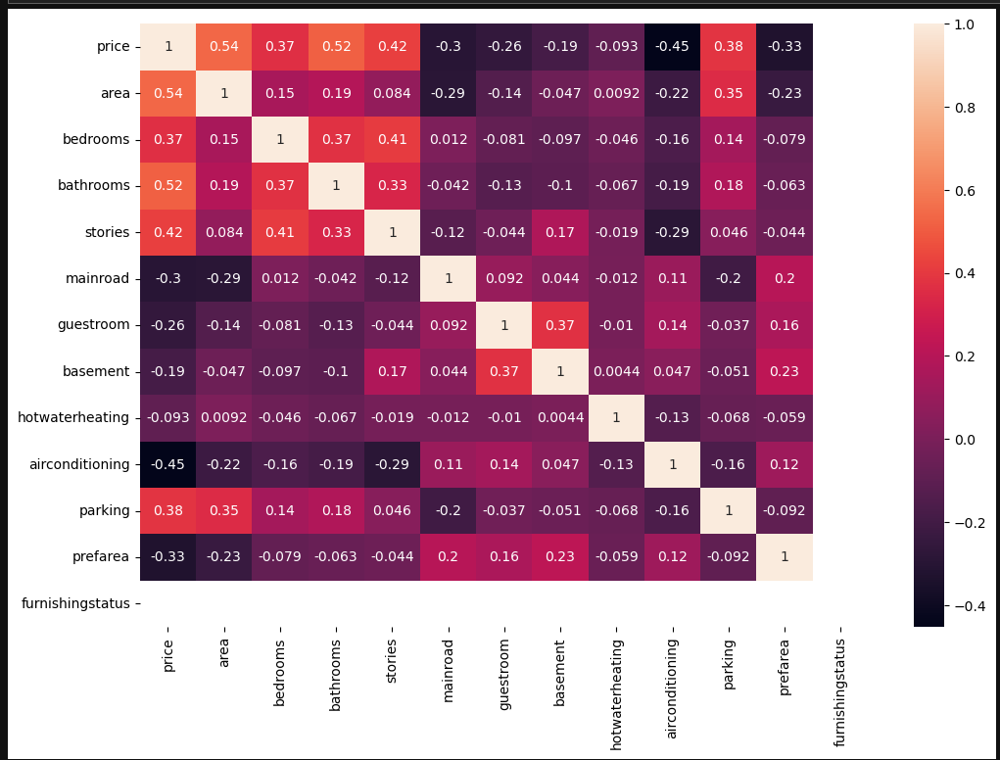
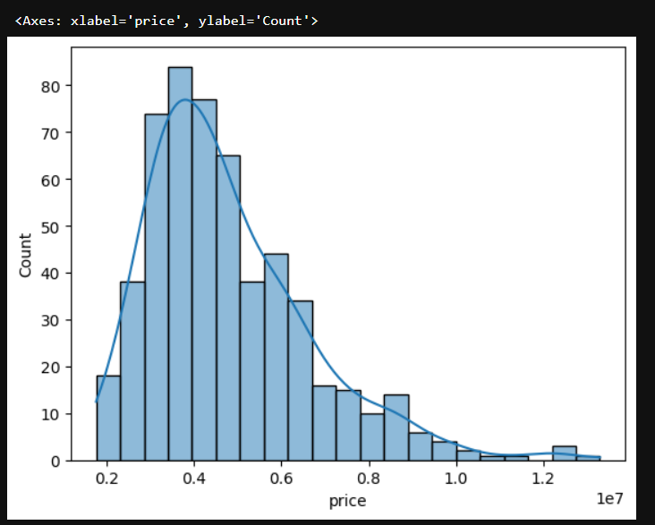
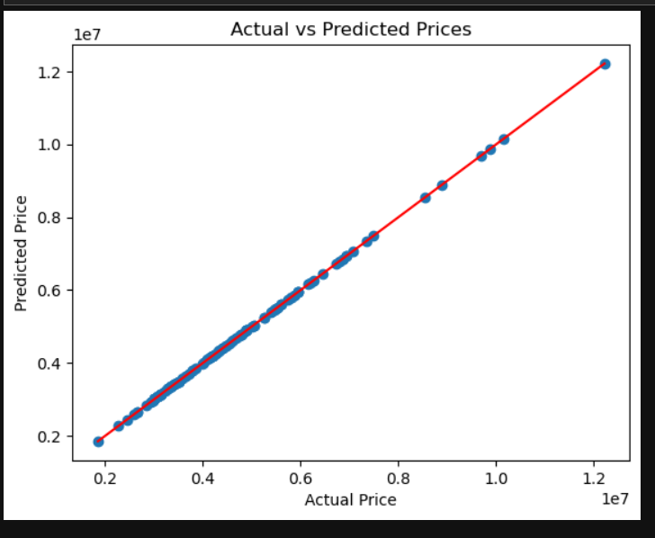

# 01-Linear-Regression-House-Price-Prediction
# 🏡 House Price Prediction using Linear Regression

## 📌 Project Overview
This project aims to build a **Machine Learning model** that predicts house prices based on different property features.  
The model helps understand how factors like **area, bedrooms, bathrooms, stories, and parking** influence house prices.

---

## 🎯 Problem Statement
Predict house prices using property-related features to help buyers, sellers, and real estate companies estimate property value more accurately.

---

## 📊 Dataset
The dataset contains the following features:

- **area** – Size of the house
- **bedrooms** – Number of bedrooms
- **bathrooms** – Number of bathrooms
- **stories** – Number of floors
- **parking** – Parking spaces available
- **price** – House price (Target variable)

---

## Feature Distribution

------
## Correlation Heatmap

----
## Actual vs Predicted Plot

## 🛠 Tools & Technologies
- Python
- Pandas
- NumPy
- Seaborn
- Matplotlib
- Scikit-learn

---

## 🔍 Project Workflow
1. Data Collection
2. Data Cleaning
3. Exploratory Data Analysis (EDA)
4. Outlier Detection
5. Feature Selection
6. Train-Test Split
7. Model Training (Linear Regression)
8. Model Evaluation

---

## 📈 Model Evaluation Metrics
The model performance was evaluated using:

- **MAE (Mean Absolute Error)**
- **MSE (Mean Squared Error)**
- **RMSE (Root Mean Squared Error)**
- **R² Score**

---

## 💡 Key Insights
- Larger houses generally have **higher prices**
- Houses with more **bathrooms and bedrooms tend to be more expensive**
- **Parking availability increases property value**

---

## ✅ Conclusion
The Linear Regression model successfully captured the relationship between house features and prices.  
This project demonstrates how **Machine Learning can assist in real estate price prediction and data-driven decision making**.
